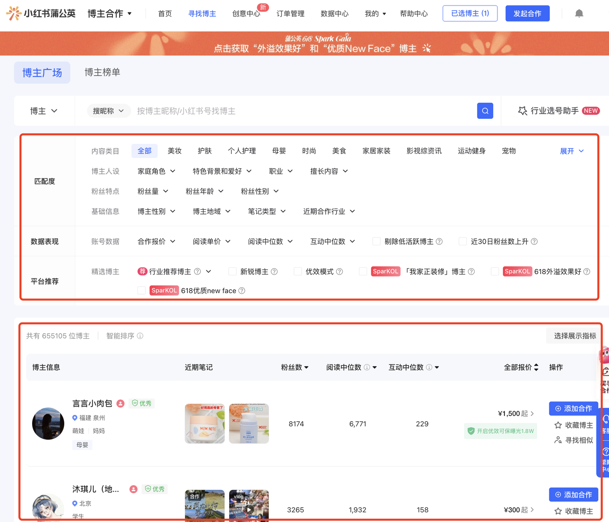
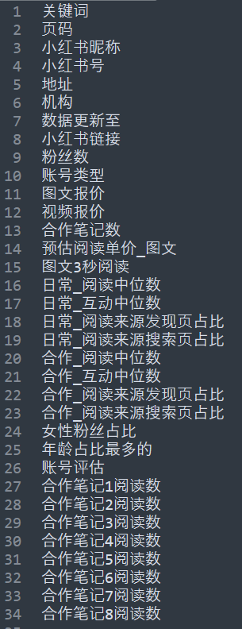
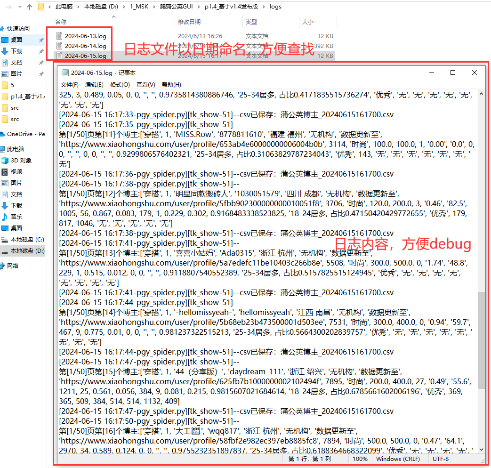

# pgy_spider

  

> 🔥 Xiaohongshu Pugongying KOL data collection tool / Xiaohongshu Pugongying KOL crawler GUI, supporting creator list collection by filtering conditions, creator detail collection, core commercial data extraction, and CSV export.
>
> 💡 Supports Windows/macOS with no Python environment required. This repository is used for software introduction, release distribution, usage documentation, and issue feedback. The complete source code is not publicly available.
>
> [⬇️Download Latest Release](https://github.com/mashukui/pgy_spider/releases) | [🎬Video Demo](https://www.bilibili.com/video/BV14J4m1T7tb) | [🏠Homepage](https://mashukui.github.io/pgy_spider/) | [💳Purchase Access](https://mgnb.pro/product/pgy)

  <a href="README.md">简体中文 README</a> | <a href="README.en.md">English README</a>

## 👋 Overview

`pgy_spider` is a desktop GUI tool designed for Xiaohongshu Pugongying creator filtering, media buying, and KOL data organization. It is built around the Pugongying "Find Creators" page and supports filtering creators by note keyword, note type, follower count, image-text quote, and search page range. It can also enter creator detail pages to collect core fields such as quotes, follower demographics, read and engagement metrics, and sponsored note performance.

Pugongying is Xiaohongshu's creator commercial collaboration platform. It usually requires an eligible business account with the required access permissions. After access is enabled, users can filter and match creators on the "Find Creators" page. This tool helps authorized users batch organize publicly visible collaboration reference data.

It is suitable for the following scenarios:

| Scenario | Description |
| --- | --- |
| ✅ Creator screening | Batch organize candidate KOLs by keyword, note type, follower count, quote range, and other filters |
| ✅ Media buying | Compare creator quotes, estimated read cost, engagement medians, and sponsored note performance for campaign planning |
| ✅ Brand seeding | Find suitable Xiaohongshu creators around industry, category, and competitor keywords |
| ✅ Data archiving | Save creator profile data, follower demographics, and commercial collaboration data from Pugongying pages as CSV |

## ⚙️ Features

| Feature | Description | Output |
| --- | --- | --- |
| ✅ Creator list collection | Collect creator list data based on Pugongying filtering conditions | CSV |
| ✅ Creator detail collection | Enter creator detail pages by creator id and collect more complete commercial data | CSV |
| ✅ Condition filters | Support keywords, note type, follower count, image-text quote, search page range, and other conditions | Collection task |
| ✅ Cookie auto configuration | Built-in cookie helper that can automatically write to `cookie.txt` | cookie.txt |
| ✅ Incremental saving | Save results during collection to reduce data loss caused by interruptions | CSV |
| ✅ Runtime logs | Record runtime logs for troubleshooting | logs files |

## 🚀 Quick Start

1. Open [Releases](https://github.com/mashukui/pgy_spider/releases) and download the latest version.
2. Extract the package and run the client for your operating system.
3. Use the built-in cookie helper to configure your cookie.
4. Log in to the software account (no account yet? [Day pass from 19 CNY, instant activation](#-pricing)).
5. Enter collection conditions such as note keyword, note type, follower count, image-text quote, and page range.
6. Click "Start" and wait for the collection task to finish.
7. Check the CSV files and log files in the software directory.

## 💻 Supported Platforms

| Platform | Support |
| --- | --- |
| Windows | Supported. Download and run the Windows client |
| macOS | Supported. Download and run the macOS client |

## 🖼️ Screenshots

### Collection Target

The Pugongying platform can be used to filter Xiaohongshu creators by conditions:

### Pugongying Find Creators Page

After entering the Pugongying "Find Creators" page, users can filter creator lists using the platform's filtering options. The upper area contains filtering conditions, and the lower area shows filtered results.

### Creator Detail Page

The software can continue to enter detail pages based on collected creator ids and organize more complete data.

### Main Interface

The current software version has been upgraded to v2.3:

### Cookie Auto Configuration

Before collection, you can use the built-in cookie helper to configure the cookie automatically. The obtained cookie value will be written to `cookie.txt`, reducing the need for manual copy-and-paste configuration.

### Fields and Result Data

The software can collect `34` core fields:

Demo data is available in the "Pugongying" sheet of the Tencent Docs file:

[https://docs.qq.com/sheet/DVEFhZlFKR1NXVEdN?tab=suenot](https://docs.qq.com/sheet/DVEFhZlFKR1NXVEdN?tab=suenot)

### Runtime Logs

Log files are generated during collection, which helps locate issues when errors occur.

## 📊 Output Fields

The software organizes CSV files based on the Pugongying filtering page and creator detail pages. Since there are many fields, the main field groups are shown first. You can expand the section below to view the full field list.

### KOL Basic Information

- Collection info: keyword, page, data updated to
- Account info: Xiaohongshu nickname, Xiaohongshu ID, Xiaohongshu profile link, location, agency, account type
- Follower info: follower count, female follower ratio, largest age group

### Commercial Quotes and Collaboration Data

- Quote info: image-text quote, video quote, estimated read cost for image-text notes
- Collaboration overview: number of sponsored notes, account evaluation
- Organic data: 3-second reads for image-text notes, read median, engagement median, discovery-page read source ratio, search-page read source ratio
- Sponsored data: sponsored read median, sponsored engagement median, sponsored discovery-page read source ratio, sponsored search-page read source ratio

### Sponsored Note Read Data

- Sponsored note performance: read counts from sponsored note 1 to sponsored note 8

View full field list

Keyword, page, Xiaohongshu nickname, Xiaohongshu ID, location, agency, data updated to, Xiaohongshu profile link, follower count, account type, image-text quote, video quote, sponsored note count, estimated read cost for image-text notes, 3-second reads for image-text notes, organic read median, organic engagement median, organic discovery-page read source ratio, organic search-page read source ratio, sponsored read median, sponsored engagement median, sponsored discovery-page read source ratio, sponsored search-page read source ratio, female follower ratio, largest age group, account evaluation, sponsored note 1 read count, sponsored note 2 read count, sponsored note 3 read count, sponsored note 4 read count, sponsored note 5 read count, sponsored note 6 read count, sponsored note 7 read count, sponsored note 8 read count

## 🛠️ Technical Notes

The software is developed in `Python`. Core modules include:

| Module | Purpose |
| --- | --- |
| tkinter | GUI interface |
| requests | API requests |
| json | Response parsing |
| pandas | CSV export |
| logging | Runtime logging |

The collection program integrates multiple page interfaces to organize creator lists, organic notes, sponsored notes, follower counts, read cost, sponsored note read counts, agency information, and other data. To protect the author's intellectual property and prevent malicious piracy, this repository only provides software documentation and partial skeleton structure. The core collection code is not publicly available.

During collection, CSV files are saved automatically, and runtime logs are recorded in the `logs` directory. Because the fields come from multiple sources, actual collection results may be affected by account permissions, filtering conditions, platform page responses, network environment, and collection frequency.

## 💰 Pricing

| Plan | Duration | Price | Recommended Usage |
| --- | --- | --- | --- |
| Day pass | 1 day | 19 CNY | Trial use or small one-time tasks |
| Monthly pass | 1 month | 149 CNY | Short-term collection needs |
| Quarterly pass | 3 months | 349 CNY | Medium-term collection needs |
| Yearly pass | 1 year | 799 CNY | Long-term stable use |

Purchase page: [https://mgnb.pro/product/pgy](https://mgnb.pro/product/pgy)

## 🔐 License and Activation Rules

- The software uses account and password login (a phone number and password are provided after purchase). One account can only be used on one computer.
- Only one software instance is allowed on a single computer. Multiple concurrent instances are not supported.
- The software is maintained by the author, and future versions will be published through [GitHub Releases](https://github.com/mashukui/pgy_spider/releases).

## 🕒 Changelog

| Version | Date | Notes |
|---|---|---|
| v2.5 | 2026-05-20 | Added auto cookie configuration tool, alert/success popups, and custom collection interval; improved one-device-one-code activation |
| v2.3 | 2026-03-24 | Added macOS client |

> For the full release history, see [Releases](https://github.com/mashukui/pgy_spider/releases)

## ❓ FAQ

### Can I use the software after changing computers or reinstalling the system?

Yes. Activation is bound to one computer per account. To switch devices, contact the [WeChat official account 老男孩的平凡之路](https://github.com/mashukui/mashukui/blob/main/wechat2.png) and request unbinding; after that you can log in on the new computer.

### Do I need to purchase again for software updates?

No. During the license period, all future versions are freely available on [GitHub Releases](https://github.com/mashukui/pgy_spider/releases). Just download the latest version and reinstall.

### Do I need to install Python?

No. The software is packaged as a desktop client. Download the version for your operating system and run it directly.

### What account permissions are required before use?

You need to use an account that already has access to Pugongying. Pugongying usually requires an eligible business account to apply for access. The software does not bypass platform permission restrictions.

### What is the cookie used for?

The cookie allows the software to access Pugongying page data under your current account session. Please use your own account cookie and keep related files secure.

### Will collected data be lost if the task is interrupted?

The software continuously saves results during collection instead of waiting until the entire task is complete. If the task is interrupted, the completed portion of the data is usually still preserved in the result files.

### Where are result files saved?

By default, result files are saved in the software directory. CSV files and log files are generated based on the collection task.

### How much data can it collect?

The actual amount of data depends on account permissions, filtering conditions, platform API responses, network environment, and collection frequency. It is recommended to set a reasonable search page range and request pace.

### What should I do if an error occurs?

Check the log files under the `logs` directory first. When reporting an issue, please provide:

- Software version
- Operating system
- Filtering conditions used
- Error screenshot
- Log content around the time when the error occurred

## ⚠️ Compliance Statement

This software is intended only for lawful and compliant data analysis, learning, research, and internal business scenarios. Users are responsible for complying with the target platform's terms of service, privacy policy, and applicable laws and regulations.

Do not use this software for:

- High-frequency, malicious, or destructive requests
- Unauthorized collection, distribution, or sale of personal sensitive information
- Bypassing platform permissions, risk controls, or access restrictions
- Infringing the legitimate rights and interests of platforms, creators, brands, or users
- Any other behavior that violates laws, regulations, or platform rules

Users are solely responsible for risks and liabilities caused by improper use.

## 📦 Get the Software

- GitHub Releases: [https://github.com/mashukui/pgy_spider/releases](https://github.com/mashukui/pgy_spider/releases)
- WeChat official account: reply with `蒲公英` in `老男孩的平凡之路`

---

More collection tools (Douyin / Xiaohongshu / Weibo / PGY / YouTube, 7 in total): <a href="https://mgnb.pro">马哥数据采集工坊 (mgnb.pro)</a>

